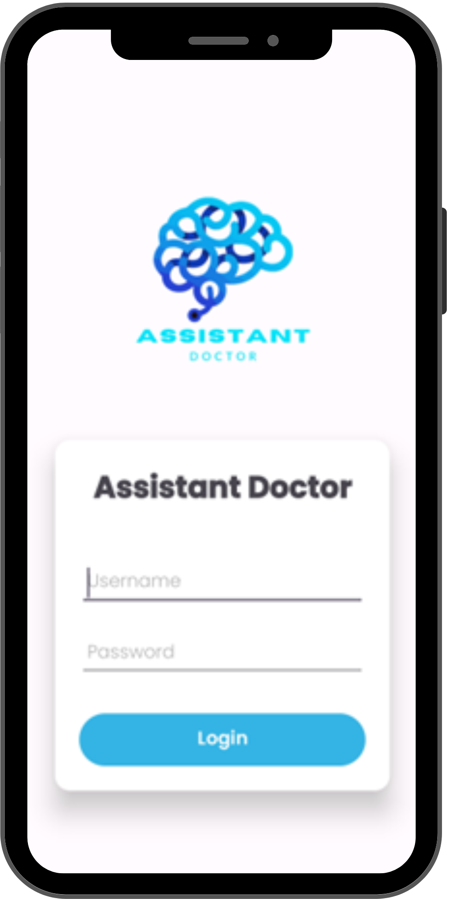
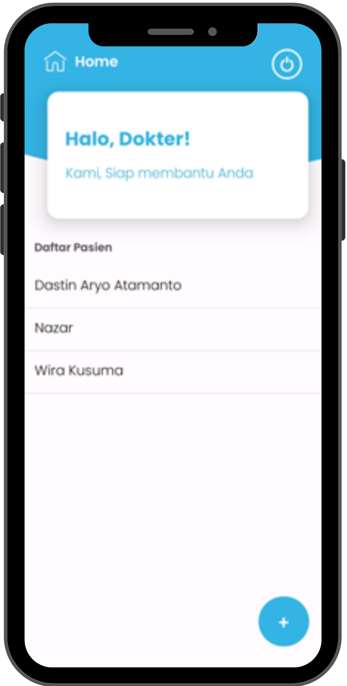
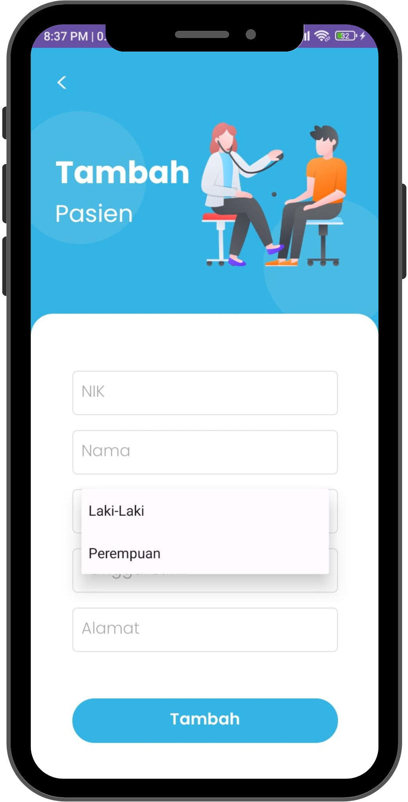
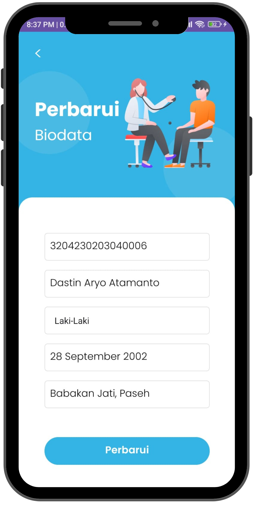
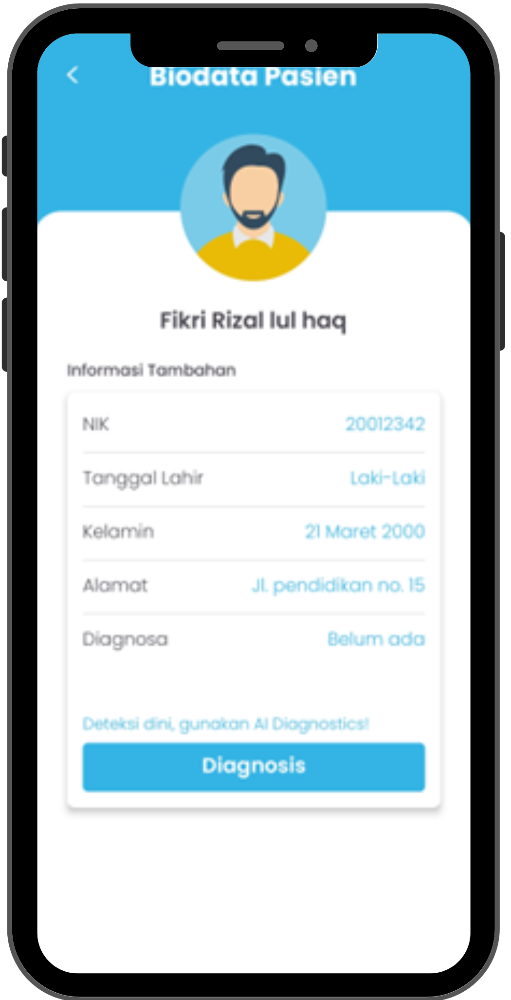
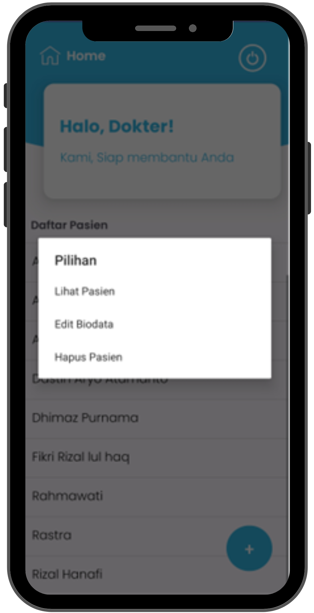
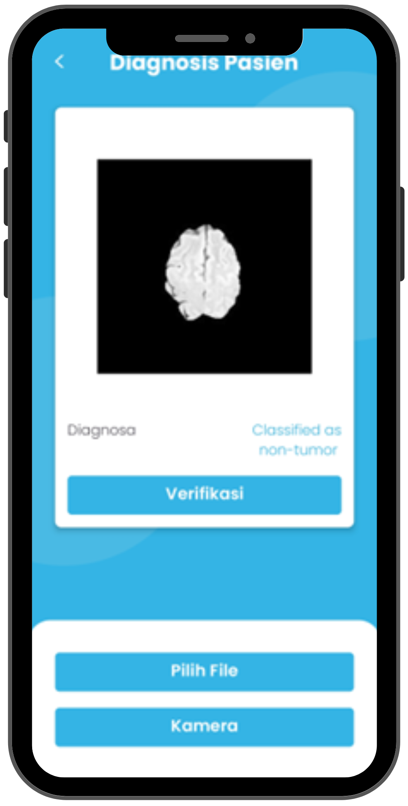

# Assistant Doctor (Developed using AI)
Technological developments have had a positive impact on the health sector. However, there are still some obstacles in patient data management and interpretation of diagnostic test results. Doctors often face challenges in recording and managing patient histories efficiently. In addition, interpretation of diagnostic test results such as X-ray images often requires time and specialised expertise.

In this context, an Android-based mobile application called ‘Assistant Doctor’ can provide an integrated solution. The app is designed to assist doctors in managing patient data and provide artificial intelligence (AI) features to detect potential brain tumours through X-ray images.

# Solutions
By presenting the ‘Assistant Doctor’ application, it is expected to improve efficiency and accuracy in patient data management and support doctors in early detection of potential brain tumours through X-ray images, assisting in the provision of faster and more effective treatment. In addition, this app supports Sustainable Development Goals (SDGs) No. 3 (Health).

## 1. Patient Data Management
The app provides an intuitive interface to record and manage patient history. Doctors can easily create, update and delete patient data digitally.

## 2. Brain Tumour Detection
Trained AI models can help identify patterns that may be difficult for the human eye to identify. The detection results will be displayed, providing the doctor with preliminary information for further evaluation.

## 3. System Integration
The app can be integrated with a hospital or health centre's management system to ensure consistency of patient data across platforms.

## 4. Periodic Updates
The app is designed to support regular updates and upgrades, including the improvement of AI models based on technological developments and the addition of relevant new features.

## How it works
### Login
Welcome Back!
Log in to access the patient management system. Your credentials keep our data secure and ensure you're where you need to be.

Login Button: Login to Your Account

    

### Dashboard
Patient Overview
Your central hub for managing patient information. Easily view and navigate through your list of patients.
Description: Here’s a quick view of all patients. Click on any patient to see more details or update their information.

    

### Add New Patient
Start managing a new patient's health journey. Fill in the details below to create a new patient profile.

    

### Update Patient Data
Update Patient Information
Keep patient records up to date. Modify existing details to ensure accuracy and comprehensive care.

    

### View Patient Data
Patient Details
Review all important information at a glance. Ensure you have everything you need to make informed decisions about patient care.

    

### Delete Patient Data
Delete Patient Record
Carefully consider before removing a patient’s data. This action is permanent and cannot be undone.

    

### Patient Diagnosis
AI-Powered X-ray Diagnosis
Leverage cutting-edge AI technology to analyze X-ray images for brain tumor identification. Our system uses advanced algorithms to detect and classify potential tumors, providing crucial insights that support accurate and timely diagnoses.

    

